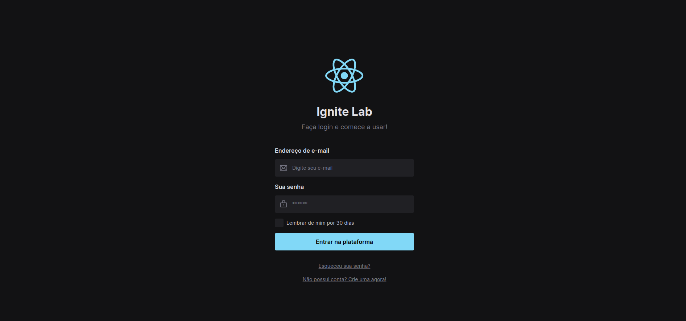

# Design System

> Ignite Lab - React



Projeto construido do evento Ignite Lab da Rocketseat.

## 🔖 Layout

[🔗 Clique aqui para acessar o projeto!](https://designsystem-liart.vercel.app/)

[🔗 Storybook](https://thiagonmiziara.github.io/Ignite-Lab-Design-System/?path=/story/components-button--default)

[🔗 Figma](https://www.figma.com/file/2OcJaL0ooGywKrjFXqJVem/Ignite-Lab-Desing-System)


## 🧪 Technologies

This project was developed using the following technologies:

- [ReactJS](https://reactjs.org/)
- [TailwindCSS](https://tailwindcss.com/)
- [Figma](https://figma.com)
- [Storybook](https://storybook.js.org/)
- [Vite](https://vitejs.dev/)
- [RadixUI](https://www.radix-ui.com/)
- [msw](https://mswjs.io/docs/getting-started/install)

## 🚀 Getting started

Clone the project and access the folder.

```bash
git clone https://github.com/thiagonmiziara/Ignite-Lab-Design-System.git

```

Run this command to install the dependencies

```bash
yarn add
```

Run this command to view the interface locally

```bash
yarn run dev
```

Run this command to to view the storybook docs

```bash
yarn run storybook
```

## Contato

📭 thiagonmiziara@gmail.com
